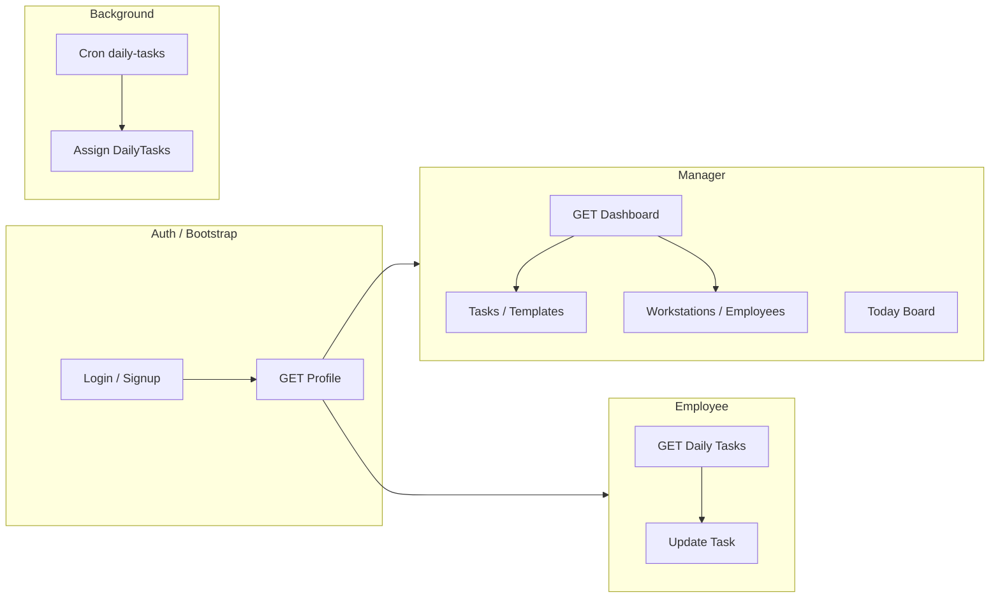

# Contexte SaaS — Tasty Crousty

Ce document est la **référence unique** pour comprendre le produit, l’architecture et les règles du SaaS. Il s’adresse aux humains (équipe produit, dev, onboarding) et aux agents IA qui travaillent sur le code. Il complète [AGENTS.md](AGENTS.md) (règles pour les agents) et [README.md](README.md) (installation, runbook).

---

## 1. Produit et positionnement

### 1.1 Nom et type

- **Nom** : Tasty Crousty  
- **Type** : B2B SaaS multi-tenant pour **restaurants**  
- **Domaine** : Gestion des tâches quotidiennes par **poste de travail** (workstation). Checklist mobile pour les équipes, suivi temps réel pour les managers.

### 1.2 Utilisateurs

| Rôle      | Description | Création / accès |
|-----------|-------------|-------------------|
| **Manager** | Crée et gère les postes (workstations), les employés, les modèles de tâches (templates). Consulte le dashboard temps réel et pilote l’équipe. | Peut s’inscrire (signup). |
| **Employé** | Voit ses tâches du jour, les coche sur mobile. Appartient à une équipe (Team). | Créé par un manager ; mot de passe défini via lien (set-password). |

### 1.3 Valeur apportée

- **Checklist mobile** pour les équipes : tâches du jour par poste, cocher au fil de l’eau.
- **Suivi temps réel** pour les managers : dashboard, état des tâches, pilotage.
- **Récurrence des tâches** : quotidienne, hebdomadaire, x par semaine, mensuelle, etc., avec assignation automatique via un job cron (ex. chaque matin à 6h).

---

## 2. Direction et évolution

### 2.1 Multi-tenant

- Un **manager** peut avoir **plusieurs équipes (Teams)**.  
- Une **équipe** = un restaurant / un site.  
- Les données sont **strictement isolées par tenant** : un manager ne voit que ses équipes ; un employé ne voit que son équipe et ses propres données.

### 2.2 Évolution prévue

- Nouveaux rôles, types de tenants, permissions possibles à l’avenir.  
- Les patterns restent **centralisés** : `requireRole`, `scopedPrisma`, guards dans `tenantGuard.ts`.  
- **Stabilité** : pas de changement destructeur (base de données, isolation). Rétrocompatibilité obligatoire.

---

## 3. Architecture technique

### 3.1 Stack

| Couche     | Technologies |
|-----------|--------------|
| **Backend** | Node.js, Express 5, Prisma 5, PostgreSQL |
| **Auth**    | JWT (cookie httpOnly), protection CSRF |
| **Frontend** | React 18 (SPA), React Router 6, TypeScript, Vite, TailwindCSS 3, Radix UI, @tanstack/react-query |
| **Temps réel** | Socket.IO |
| **Déploiement** | Une base PostgreSQL, multi-tenant **logique** (pas de DB par tenant), `prisma migrate deploy` en production |

### 3.2 Multi-tenant (logique)

- **Une seule base PostgreSQL** ; pas de base par tenant.  
- **Tenant** = périmètre de visibilité :
  - **Manager** : toutes ses équipes (`teamIds`).
  - **Employé** : son équipe (`teamId`).
- Contexte tenant : `server/security/tenant-context.ts` → `loadTenantContextFromAuth(payload)`.
- Toute donnée sensible au tenant (team, user, workstation, taskTemplate, dailyTask, dayPreparation, managerKpiEvent) doit passer par **`scopedPrisma(tenant)`** (`server/security/scoped-prisma.ts`), **jamais** par le `PrismaClient` global — sauf dans les flux d’auth/bootstrap où le tenant n’est pas encore résolu.

### 3.3 Pipeline requête (authentifiée)

1. **`requireAuth`** : valide le JWT, pose `req.auth`.  
2. **`requireTenantContext`** : résout et stocke le contexte tenant (manager = liste des teamIds, employé = son teamId).  
3. Les handlers utilisent **`getTenantOrThrow(req, res)`** et **`scopedPrisma(tenant)`** pour les accès données.

Chaîne globale (ex. dans `server/index.ts`) :

- `withTenantContext = [requireAuth, requireTenantContext]`
- `withManagerTenantContext = [requireAuth, requireTenantContext, requireRole("MANAGER")]`

### 3.4 Sécurité

- **403** (ou 404 selon la politique de l’endpoint) pour tout accès hors scope.  
- Ne jamais faire confiance aux paramètres de route sans validation du scope.  
- Guards centralisés dans `server/security/tenantGuard.ts` : `assertManagerOwnsTeam`, `assertEmployeeOwnsTask`, `assertTenantAccessToResource`.

---

## 4. Flux principaux

### 4.1 Auth

- **Login / Signup** (managers), **set-password** (employés), **forgot / reset password**.  
- JWT stocké en cookie httpOnly.  
- **GET Profile** renvoie l’utilisateur (dont `role`, `teamId` pour un employé).

### 4.2 Manager

- **Dashboard** : `GET /api/manager/dashboard?date=...` — agrège les équipes gérées ; renvoie une équipe « courante » (ex. première par nom), membres, postes, tâches du jour.  
- **Today Board**, **Templates**, **Postes (workstations)**, **Employés**, pilotage (attention) et rapports hebdo.

### 4.3 Employé

- **GET /api/tasks/daily?date=...** : tâches du jour.  
- **PATCH /api/tasks/daily/:id** : cocher / mettre à jour une tâche.

### 4.4 Cron (assignation quotidienne)

- **POST /api/cron/daily-tasks** (avec header `X-Cron-Secret`).  
- Crée les `DailyTask` pour les templates récurrents à la date donnée (ou aujourd’hui).  
- À lancer chaque matin (ex. 6h) via un cron externe (cron-job.org, GitHub Actions, crontab, etc.).  
- Sans `CRON_SECRET` configuré → 503 ; secret invalide ou absent → 401.

---

## 5. Modèle de données (essentiel)

| Modèle | Rôle |
|--------|------|
| **Team** | Restaurant / site. `managerId`, `tenantKey` (optionnel, préparation RLS). |
| **User** | `role` (MANAGER \| EMPLOYEE), `teamId` (employé = une équipe ; manager = null, lien via `managedTeams`). |
| **Workstation** | Poste de travail, `teamId`. |
| **EmployeeWorkstation** | Lien N–N employé ↔ poste. |
| **TaskTemplate** | Tâche type : titre, récurrence, poste ou employé assigné. |
| **DailyTask** | Instance pour un jour : snapshot template immuable (`templateSourceId`, `templateTitle`, etc.), `date`, `status`, `isCompleted`. |
| **DayPreparation** | Préparation de journée côté manager. |
| **ManagerKpiEvent** | Événements KPI (pilotage). |

Modèles sensibles au tenant (à accéder uniquement via `scopedPrisma(tenant)`) :  
`team`, `user`, `workstation`, `employeeWorkstation`, `taskTemplate`, `dailyTask`, `dayPreparation`, `managerKpiEvent`.

---

## 6. Fichiers clés

| Rôle | Fichiers |
|------|----------|
| **Règles agents / prod** | [AGENTS.md](AGENTS.md) |
| **Install / runbook** | [README.md](README.md) |
| **Contexte produit (ce doc)** | [contexte.md](contexte.md) |
| **Isolation tenant** | [docs/TENANT-ISOLATION-ARCHITECTURE.md](docs/TENANT-ISOLATION-ARCHITECTURE.md), [server/security/scoped-prisma.ts](server/security/scoped-prisma.ts), [server/security/tenant-context.ts](server/security/tenant-context.ts) |
| **Auth / tenant dans les routes** | [server/middleware/requireAuth.ts](server/middleware/requireAuth.ts), [server/middleware/requireTenantContext.ts](server/middleware/requireTenantContext.ts), [server/routes/auth.ts](server/routes/auth.ts) |
| **Tâches & dashboard** | [server/routes/tasks.ts](server/routes/tasks.ts) |
| **Postes & employés** | [server/routes/workstations.ts](server/routes/workstations.ts) |
| **Assignation quotidienne** | [server/jobs/daily-task-assignment.ts](server/jobs/daily-task-assignment.ts) |
| **Schéma BDD** | [prisma/schema.prisma](prisma/schema.prisma) |
| **Tests isolation tenant** | [server/tenant-security.spec.ts](server/tenant-security.spec.ts) |

---

## 7. Conventions et contraintes

### 7.1 Base de données (production)

- **Migrations additives uniquement** : pas de drop table/column, pas de changement de type destructif.  
- Autorisé : nouvelles colonnes (nullable ou avec valeur par défaut), nouvelles tables, index, nouvelles FK (après vérification des orphelins), nouveaux rôles/enums.  
- Interdit : supprimer tables/colonnes, modifier les types de façon destructive, supprimer des contraintes qui protègent l’intégrité.

### 7.2 Tenant

- Toujours **`scopedPrisma(tenant)`** pour les modèles sensibles.  
- Pas de raw SQL non scopé sur ces données.  
- Exception bootstrap : appels directs au `PrismaClient` uniquement pour login, restauration de session, liste des équipes de l’utilisateur — sans écriture tenant-sensitive avant résolution du tenant.

### 7.3 Tests

- **Gate complet** : `pnpm run ci` (typecheck + seed + suite complète client + serveur).  
- **Tests frontend** : `pnpm test:client`.  
- Couverture minimale d’isolation : manager A ne voit pas les données du tenant B ; employé ne peut pas accéder à une autre équipe ; accès hors scope → 403 (ou 404 selon l’endpoint).

### 7.4 Definition of done

Une tâche est terminée seulement si :

- L’isolation tenant est préservée.  
- L’intégrité de la base est préservée.  
- La fonctionnalité fonctionne.  
- Pas d’erreurs TypeScript.  
- Les tests passent.  
- Aucun pattern de requête unsafe introduit.  
- Les changements sont rétrocompatibles.

---

## Résumé pour une IA

- **Produit** : SaaS B2B multi-tenant pour restaurants (Tasty Crousty) — tâches quotidiennes par poste, checklist employés, dashboard managers.  
- **Tenant** = périmètre (manager = ses teams, employé = son team). Données sensibles **uniquement** via `scopedPrisma(tenant)`.  
- **Pipeline** : `requireAuth` → `requireTenantContext` → handlers avec `getTenantOrThrow` + `scopedPrisma`.  
- **Règles strictes** : pas de changement destructeur en base, pas de bypass de l’isolation, tests d’isolation obligatoires.  
- **Références détaillées** : [AGENTS.md](AGENTS.md) pour les règles de code, [README.md](README.md) pour l’install et le runbook, [docs/TENANT-ISOLATION-ARCHITECTURE.md](docs/TENANT-ISOLATION-ARCHITECTURE.md) pour l’architecture d’isolation.
